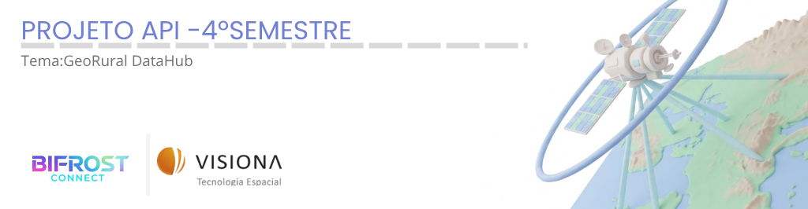
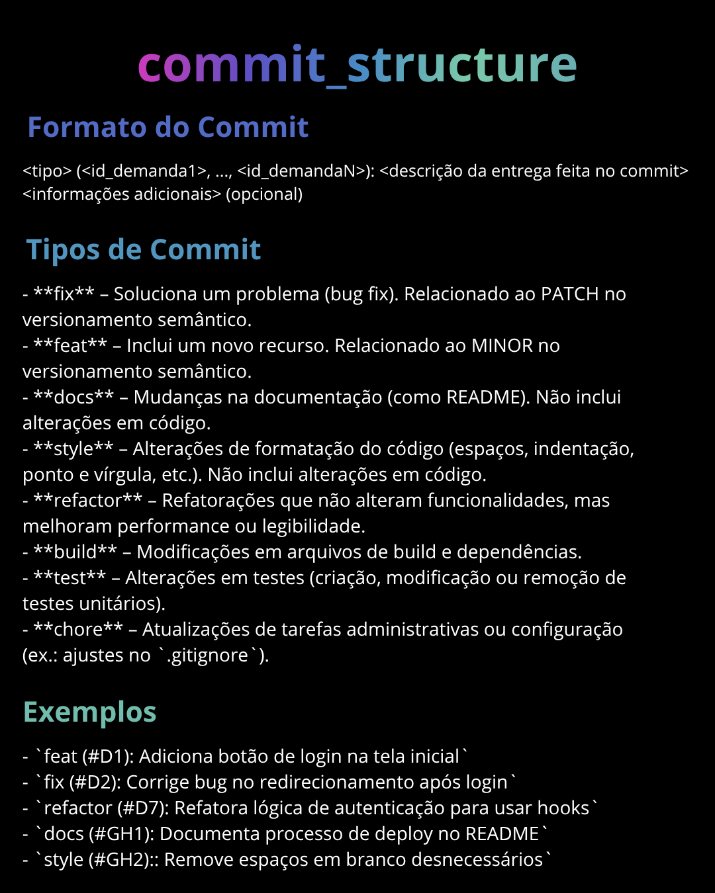

<h1 align="center">API 4º Semestre - GeoRural DataHub (Visiona Tecnologia Espacial)</h1>

  

---

<a href="#desafio">🎯 Desafio</a> | 
<a href="#objetivo">✅ Objetivo</a> | 
<a href="#product-backlog">📖 Backlog do Produto</a> | 
<a href="#detalhamento-stories">🏃 Detalhamento das User Stories (DoR)</a> | 
<a href="#evidencias-dod">🟢 Evidências de Conclusão (DoD)</a> | 
<a href="#tecnologias">💻 Tecnologias</a> | 
<a href="#sprints">📌 Cronograma de Sprints</a> | 
<a href="#manual-instalacao">📘 Manual de Instalação</a> | 
<a href="#membros">👥 Membros</a>

 

<table>
  <tr>
    <td><strong>Status do Projeto:</strong></td>
    <td>🟡 Em andamento</td>
  </tr>
</table>

 

<h2 id="desafio">🎯 Desafio Proposto</h2>

A <strong>Visiona Tecnologia Espacial</strong> trabalha com dados territoriais e de satélite para apoiar fiscalizações ambientais e análise de conformidade em crédito rural. No dia a dia, os dados de imóveis rurais (CAR), Reservas Legais (RL), APPs e alertas de desmatamento chegam de várias fontes (como IBAMA, MapBiomas e INCRA). O problema é que essas bases vêm sem padrão nenhum, com geometrias sobrepostas, cadastros duplicados e mudanças constantes. Sem um controle centralizado, fica impossível responder: <em>qual arquivo foi usado no cálculo, o que foi barrado por inconsistência e como recalcular ou auditar um resultado antigo</em>.

 

<h2 id="objetivo">✅ Objetivo da Solução</h2>

Desenvolver o <strong>GeoRural DataHub</strong>, uma plataforma de dados espaciais dividida em quatro camadas (Zona Bruta, Quarentena, Tratada e Publicada). O sistema automatiza a entrada de dados com checagem de erros, separa os registros com falha antes do processamento, roda os cruzamentos territoriais no banco e gera versões oficiais fechadas dos indicadores ambientais para garantir que qualquer análise possa ser auditada e reproduzida no futuro.

 

<h2 id="product-backlog">📖 Backlog do Produto</h2>

<table>
  <thead>
    <tr>
      <th>Rank</th>
      <th>Prioridade</th>
      <th>User Story</th>
      <th>Estimativa (SP)</th>
      <th>Sprint</th>
    </tr>
  </thead>
  <tbody>
    <!-- SPRINT 1 -->
    <tr>
      <td>1</td>
      <td>Alta</td>
      <td>Como <strong>operador de dados</strong>, quero <strong>cadastrar os dados de origem de uma base (órgão emissor, ano e sistema de coordenadas)</strong> para organizar a procedência dos arquivos e saber exatamente qual safra está entrando no sistema.</td>
      <td>5</td>
      <td>1</td>
    </tr>
    <tr>
      <td>2</td>
      <td>Alta</td>
      <td>Como <strong>operador de dados</strong>, quero <strong>fazer upload salvando uma cópia original com hash SHA-256 na Zona Bruta</strong> para garantir que o arquivo enviado não foi alterado ou corrompido durante a ingestão.</td>
      <td>8</td>
      <td>1</td>
    </tr>
    <tr>
      <td>3</td>
      <td>Alta</td>
      <td>Como <strong>operador de dados</strong>, quero <strong>um filtro que desvie registros inconsistentes para quarentena</strong> para barrar geometrias quebradas ou dados duplicados antes que eles cheguem na base tratada.</td>
      <td>8</td>
      <td>1</td>
    </tr>
    <tr>
      <td>4</td>
      <td>Alta</td>
      <td>Como <strong>operador de dados</strong>, quero <strong>ver o andamento das etapas da carga na tela</strong> para saber rapidamente em qual passo o processamento está e onde deu erro se a execução falhar.</td>
      <td>8</td>
      <td>1</td>
    </tr>
    <!-- SPRINT 2 -->
    <tr>
      <td>5</td>
      <td>Alta</td>
      <td>Como <strong>auditor ambiental</strong>, quero <strong>rastrear a linhagem de um indicador até o arquivo bruto de entrada</strong> para comprovar para auditorias quais bases e versões serviram de insumo pro cálculo.</td>
      <td>13</td>
      <td>2</td>
    </tr>
    <tr>
      <td>6</td>
      <td>Alta</td>
      <td>Como <strong>analista territorial</strong>, quero <strong>calcular no sistema a área de sobreposição entre polígonos do CAR e alertas ambientais</strong> para não depender de cálculos manuais demorados na emissão de laudos.</td>
      <td>13</td>
      <td>2</td>
    </tr>
    <tr>
      <td>7</td>
      <td>Alta</td>
      <td>Como <strong>gestor de dados</strong>, quero <strong>travar versões homologadas de indicadores impedindo qualquer alteração</strong> para não correr o risco de atualizações novas apagarem análises feitas no passado.</td>
      <td>8</td>
      <td>2</td>
    </tr>
    <tr>
      <td>8</td>
      <td>Média</td>
      <td>Como <strong>analista territorial</strong>, quero <strong>visualizar os polígonos e sobreposições em um mapa interativo</strong> para conferir as irregularidades em tela sem precisar abrir softwares pesados de GIS no computador.</td>
      <td>8</td>
      <td>2</td>
    </tr>
    <!-- SPRINT 3 -->
    <tr>
      <td>9</td>
      <td>Média</td>
      <td>Como <strong>analista de dados</strong>, quero <strong>um catálogo com todas as bases carregadas e o status de cada uma</strong> para achar rápido quais dados estão prontos e disponíveis para consulta.</td>
      <td>5</td>
      <td>3</td>
    </tr>
    <tr>
      <td>10</td>
      <td>Média</td>
      <td>Como <strong>analista territorial</strong>, quero <strong>comparar duas safras de uma mesma região lado a lado</strong> para avaliar visualmente como as áreas de desmatamento ou alertas mudaram ao longo do tempo.</td>
      <td>8</td>
      <td>3</td>
    </tr>
    <tr>
      <td>11</td>
      <td>Média</td>
      <td>Como <strong>gestor ambiental</strong>, quero <strong>exportar os resultados em tabelas CSV ou GeoJSON</strong> para compartilhar as métricas com áreas parceiras e gerar relatórios externos.</td>
      <td>5</td>
      <td>3</td>
    </tr>
    <tr>
      <td>12</td>
      <td>Baixa</td>
      <td>Como <strong>integrador externo</strong>, quero <strong>gerar chaves de API com opção de revogação</strong> para integrar outros sistemas com segurança sem ter que passar senha de login.</td>
      <td>5</td>
      <td>3</td>
    </tr>
    <tr>
      <td>13</td>
      <td>Baixa</td>
      <td>Como <strong>administrador</strong>, quero <strong>gerenciar perfis e permissões dos usuários</strong> para que cada membro do time acerte apenas nas funções que competem ao seu papel no projeto.</td>
      <td>3</td>
      <td>3</td>
    </tr>
  </tbody>
</table>

 

<h2 id="detalhamento-stories">🏃 Detalhamento das User Stories (DoR)</h2>
<table>
  <thead>
    <tr>
      <th>Conteúdo Disponível</th>
      <th>Link de Acesso</th>
    </tr>
  </thead>
  <tbody>
    <tr>
      <td>Regras de negócio, especificação das 4 zonas do DataLake, wireframes e critérios de prontidão.</td>
      <td><a href="./docs/processo/DoR/DoR_Backlog_Produto.md">🔍 Acessar Detalhamento (DoR)</a></td>
    </tr>
  </tbody>
</table>

 

<h2 id="evidencias-dod">🟢 Evidências de Conclusão (DoD)</h2>
<table>
  <thead>
    <tr>
      <th>Garantia de Qualidade</th>
      <th>Relatório Completo</th>
    </tr>
  </thead>
  <tbody>
    <tr>
      <td>Testes unitários e de integração, scripts PL/SQL validados, DAGs homologadas e documentação OpenAPI.</td>
      <td><a href="./docs/processo/DoD/Definition_of_Done.md">📊 Visualizar Evidências (DoD)</a></td>
    </tr>
  </tbody>
</table>

 

<h2 id="tecnologias">💻 Tecnologias e Ferramentas</h2>

<table>
  <thead>
    <tr>
      <th>Camada</th>
      <th>Tecnologias Utilizadas</th>
    </tr>
  </thead>
  <tbody>
    <tr>
      <td><strong>Backend</strong></td>
      <td>Java 21, Spring Boot 3 (APIs REST), Spring Data JPA/Hibernate, Spring Security e OpenAPI/Swagger.</td>
    </tr>
    <tr>
      <td><strong>Banco de Dados</strong></td>
      <td>Oracle Database, procedures e rotinas de cruzamento espacial em PL/SQL com suporte a GIS.</td>
    </tr>
    <tr>
      <td><strong>Engenharia de Dados</strong></td>
      <td>Apache Airflow (orquestração de DAGs) e armazenamento em Object Storage (Zonas Bruta, Quarentena, Tratada e Publicada).</td>
    </tr>
    <tr>
      <td><strong>Frontend</strong></td>
      <td>Vue.js 3, Axios para chamadas HTTP, Leaflet para mapas dinâmicos e Chart.js para gráficos.</td>
    </tr>
  </tbody>
</table>

 

<h2 id="sprints">📌 Cronograma de Sprints (Épicos)</h2>

<table>
  <thead>
    <tr>
      <th>Sprint</th>
      <th>Épico / Foco de Entrega</th>
      <th>Principais Entregas</th>
      <th>Documentação</th>
    </tr>
  </thead>
  <tbody>
    <tr>
      <td><strong>Sprint 1</strong></td>
      <td>Épico 1: Ingestão, Quarentena e Orquestração do Fluxo</td>
      <td>Cadastro de Datasets/Fontes, Upload na Zona Bruta com Hash SHA-256, Motor de Validação com Desvio para Quarentena e Monitoramento de DAGs no Airflow.</td>
      <td><a href="./docs/processo/sprints/Sprint_1.md">📂 Ver Sprint 1</a></td>
    </tr>
    <tr>
      <td><strong>Sprint 2</strong></td>
      <td>Épico 2: Análise Espacial, Rastreabilidade e Versionamento</td>
      <td>Linhagem do Indicador ponta a ponta, Cruzamento Territorial (CAR vs. Alertas/APPs), Fechamento de Versões Imutáveis e Mapa Interativo com Leaflet.</td>
      <td><a href="./docs/processo/sprints/Sprint 2">📂 Ver Sprint 2</a></td>
    </tr>
    <tr>
      <td><strong>Sprint 3</strong></td>
      <td>Épico 3: Inteligência, Portabilidade e Governança</td>
      <td>Catálogo Completo de Datasets, Comparação Temporal entre Versões (Chart.js), Exportação Estruturada (CSV/GeoJSON), API Keys e Gestão de Perfis de Usuários.</td>
      <td><a href="./docs/processo/sprints/Sprint 3">📂 Ver Sprint 3</a></td>
    </tr>
  </tbody>
</table>

 

<h2 id="manual-instalacao">📘 Manual de Instalação e Execução</h2>

Passo a passo para rodar o projeto localmente:

<table>
  <thead>
    <tr>
      <th>Ferramenta</th>
      <th>Instalação</th>
      <th>Comando de Teste</th>
    </tr>
  </thead>
  <tbody>
    <tr>
      <td><strong>Git</strong></td>
      <td><a href="https://git-scm.com/downloads">📥 Download Git</a></td>
      <td><code>git --version</code></td>
    </tr>
    <tr>
      <td><strong>Java JDK (17 ou 21)</strong></td>
      <td><a href="https://www.oracle.com/java/technologies/downloads/">📥 Download JDK</a></td>
      <td><code>java -version</code></td>
    </tr>
    <tr>
      <td><strong>Maven</strong></td>
      <td><a href="https://maven.apache.org/download.cgi">📥 Download Maven</a></td>
      <td><code>mvn -version</code></td>
    </tr>
    <tr>
      <td><strong>Node.js & npm</strong></td>
      <td><a href="https://nodejs.org/">📥 Download Node.js</a></td>
      <td><code>node -v && npm -v</code></td>
    </tr>
    <tr>
      <td><strong>Oracle Client / SQL Developer</strong></td>
      <td><a href="https://www.oracle.com/database/sqldeveloper/">📥 Download SQL Developer</a></td>
      <td>Conexão à base local/homologação</td>
    </tr>
    <tr>
      <td><strong>Docker & Docker Compose</strong></td>
      <td><a href="https://www.docker.com/products/docker-desktop/">📥 Download Docker Desktop</a></td>
      <td><code>docker compose version</code></td>
    </tr>
  </tbody>
</table>

 

<h3>🌳 Estrutura de Branches</h3>

<table>
  <tr>
    <td><strong>main</strong></td>
    <td>Versão estável das entregas de final de Sprint.</td>
  </tr>
  <tr>
    <td><strong>develop</strong></td>
    <td>Branch de integração dos desenvolvimentos em andamento.</td>
  </tr>
  <tr>
    <td><strong>feature/*</strong></td>
    <td>Branches pontuais para desenvolvimento de cada User Story (ex: <code>feature/us02-ingestao-bruta</code>).</td>
  </tr>
  <tr>
    <td><strong>bugfix/*</strong></td>
    <td>Correções rápidas de problemas encontrados em testes.</td>
  </tr>
</table>

 

<h3>📦 Organização de Pastas</h3>

<pre>
georural-datahub/
 ├── backend/            # Código Java/Spring Boot (Controllers, Services, Repositories)
 ├── frontend/           # Aplicação Vue.js (Telas, Componentes de Mapa e Gráficos)
 ├── database/           # Scripts DDL, DML e procedures PL/SQL para o Oracle
 ├── airflow/            # DAGs de ingestão e orquestração do pipeline
 └── docs/               # Documentações, DoR, DoD e diagramas de modelagem
</pre>

 

<h3 id="execucao">🚀 Como Rodar Localmente</h3>

<table>
  <thead>
    <tr>
      <th>Etapa</th>
      <th>Serviço</th>
      <th>Comando</th>
    </tr>
  </thead>
  <tbody>
    <tr>
      <td><strong>1. Clonar</strong></td>
      <td>Repositório</td>
      <td><code>git clone https://github.com/SEU_USUARIO/GeoRural-DataHub.git</code> <code>cd GeoRural-DataHub</code></td>
    </tr>
    <tr>
      <td><strong>2. Infraestrutura</strong></td>
      <td>Airflow & Storage</td>
      <td><code>cd airflow && docker compose up -d</code></td>
    </tr>
    <tr>
      <td><strong>3. Banco</strong></td>
      <td>Oracle Database</td>
      <td>Executar scripts SQL da pasta <code>/database/scripts/</code> no Oracle.</td>
    </tr>
    <tr>
      <td><strong>4. Backend</strong></td>
      <td>Spring Boot</td>
      <td><code>cd backend && mvn clean spring-boot:run</code> Swagger: <code>http://localhost:8080/swagger-ui.html</code></td>
    </tr>
    <tr>
      <td><strong>5. Frontend</strong></td>
      <td>Vue.js</td>
      <td><code>cd frontend && npm install && npm run dev</code> Aplicação: <code>http://localhost:5173</code></td>
    </tr>
  </tbody>
</table>

---

<h2> # 📝 Padrão de Commits </h2>

---

<h2 id="membros">👥 Membros da Equipe</h2>

| Foto | Nome | Função no Projeto | GitHub | LinkedIn |
| :--: | :--: | :---------------: | :----: | :------: |
|  | Daniel Natan | Product Owner |  |  |
|  | Leonardo Graciano | Scrum Master |  |  |
|  | Guilherme Gomes | Desenvolvedor |  |  |
|  | Ana França | Desenvolvedor |  |  |
|  | Luan | Desenvolvedor |  |  |
|  | Niuan Souza | Desenvolvedor |  |  |
|  | Vitor Samuel | Desenvolvedor |  |  |
|  | João Vinícius | Desenvolvedor |  |  |

 

<h2 id="gestao">📋 Gestão do Projeto</h2>
<table>
  <thead>
    <tr>
      <th>Ferramenta</th>
      <th>Organização das Atividades</th>
    </tr>
  </thead>
  <tbody>
    <tr>
      <td></td>
      <td>
        O time utiliza o Notion para acompanhar as entregas e a evolução das Sprints:
        <ul>
          <li><strong>Backlog do Produto:</strong> Priorização das histórias das 3 Sprints.</li>
          <li><strong>Quadro Kanban:</strong> Divisão das tarefas técnicas entre backend, frontend e banco de dados.</li>
          <li><strong>Critérios de Aceite:</strong> Acompanhamento do que está pronto para desenvolvimento (DoR) e pronto para entrega (DoD).</li>
        </ul>
      </td>
    </tr>
    <tr>
      <td colspan="2" align="center">
        🔗 <strong><a href="https://www.notion.so/33ba656f7280808fa1cee382273beaac?v=33ba656f72808016929d000c07903970">Acessar quadro no Notion</a></strong>
      </td>
    </tr>
  </tbody>
</table>
